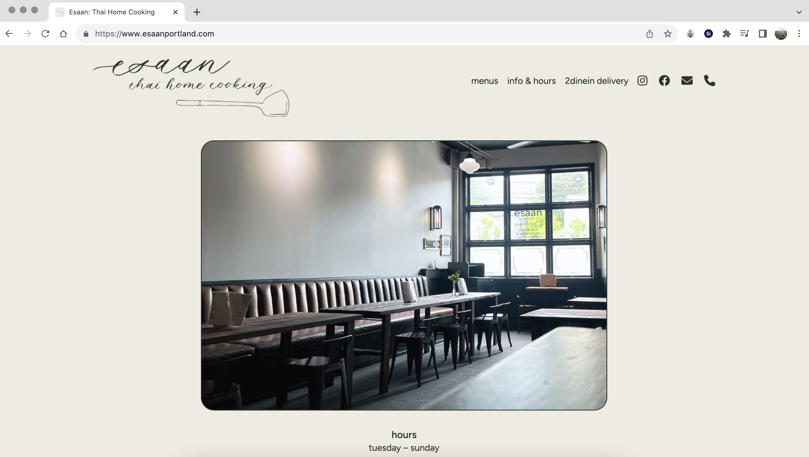
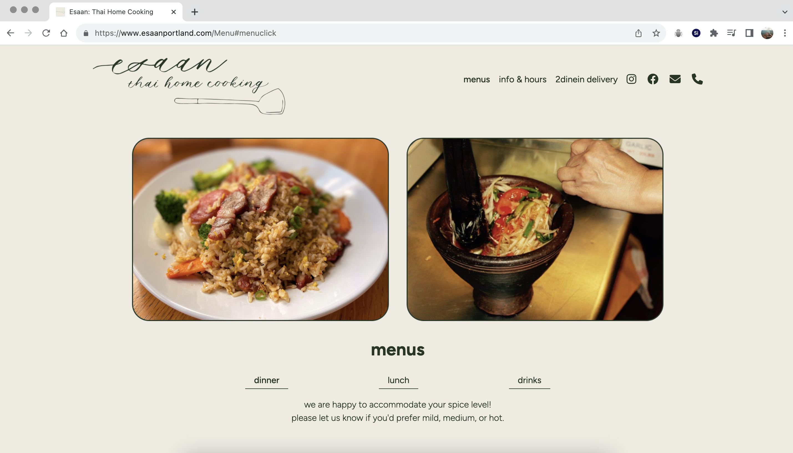

 

# Esaan

Esaan is a 3 page website created with React for a family-owned Thai restaurant in Portland, ME. When designing the site with Figma, I wanted to provide an informative, yet sleek user-experience that matched the restaurant’s down-to-earth setting. 

Here you will find the source code for the project and a link to the deployed site hosted via Dreamhost: https://www.esaanportland.com/

#### Project Goals: 

 * create a mobile-friendly version
 * digitally translate the pdf menu into a visually engaging web page with multiple sub-categories 
 * connect to third-party apps for online ordering
 * set up and launch site via Dreamhost 

#### Approach:

I chose to use React to build this site due to the framework’s capabilities to create reusable components. This way, changing menu data could be represented via their own components and seamlessly integrate into each manageable menu page.

 **Languages**: JavaScript | CSS | HTML
  
 **Frameworks**: React
 **Libraries**: React Router
 **UX/UI**: Figma | Canva 

 

